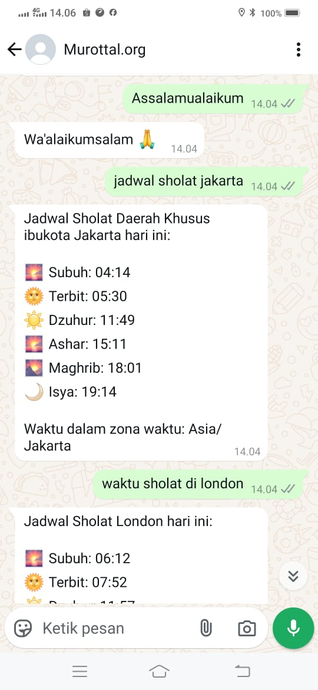

# Sholat Live API

A comprehensive Islamic Prayer Times solution powered by Azure Functions, featuring an intelligent WhatsApp chatbot with natural language understanding. The system combines the accuracy of the Moonsighting Committee calculation method with the convenience of WhatsApp messaging and the intelligence of OpenAI's GPT models. Users can easily request prayer times, ask Islamic questions, and manage cities through WhatsApp, while the AI-powered conversation system ensures natural and informative responses in both English and Indonesian.

## Try It Now! 📱

Experience the prayer times bot directly through WhatsApp:

1. Save this number: **[+62 822-3127-1520](https://wa.me/6282231271520)**
2. Send a message like:
   - `jadwal sholat jakarta`
   - `prayer times london`
   - Or simply say `Assalamualaikum` to start a conversation!

The bot is available 24/7 and supports both English and Indonesian languages.

## Screenshots 📱

<div align="center">
  
  
</div>

## Features

### Core Features
- 🕌 Accurate prayer times calculation using Moonsighting Committee method
- 🌍 Global coverage with automatic timezone detection
- 📅 Daily and monthly prayer time schedules
- 🤖 Smart WhatsApp chatbot with natural language processing
- 🧠 AI-powered conversations using Azure OpenAI
- 📱 REST API endpoints for easy integration

### WhatsApp Bot Features
- 🗣️ Natural language understanding for prayer time requests
- 🌆 Dynamic city management with automatic geocoding
- 🕒 Timezone-aware responses
- 💬 Smart conversations with Islamic greetings recognition
- 🤖 AI-powered responses for general Islamic questions
- 🔍 Fuzzy matching for city names
- 📍 Support for multi-word city names
- 🌐 Background processing for new city additions

## Requirements

### System Requirements
- Node.js 20 or later
- Azure Functions Core Tools v4
- MongoDB (or Azure Cosmos DB with MongoDB API)
- Azure OpenAI service access

### API Keys Required
- WhatsApp Business API credentials
- TimezoneDB API key
- Azure OpenAI API key
- MongoDB connection string

## Installation

1. Clone the repository:
```bash
git clone https://github.com/dodyw/sholat-live.git
cd sholat-live/serverless
```

2. Install dependencies:
```bash
npm install
```

3. Set up environment variables in `.env`:
```bash
WHATSAPP_TOKEN=your_whatsapp_token
WHATSAPP_PHONE_NUMBER_ID=your_phone_number_id
WHATSAPP_VERIFY_TOKEN=your_verify_token
MONGODB_URI=your_mongodb_uri
TIMEZONE_DB_KEY=your_timezonedb_key
AZURE_OPENAI_ENDPOINT=your_azure_openai_endpoint
AZURE_OPENAI_API_KEY=your_azure_openai_key
AZURE_OPENAI_DEPLOYMENT_NAME=your_deployment_name
```

4. Run locally:
```bash
func start
```

## API Documentation

### 1. Daily Prayer Times
```
GET https://sholatlive-api.azurewebsites.net/api/prayer-times
```

Parameters:
- `latitude` (required): Latitude of the location
- `longitude` (required): Longitude of the location
- `date` (optional): Date in YYYY-MM-DD format
- `timezone` (optional): IANA timezone name

### 2. Monthly Prayer Times
```
GET https://sholatlive-api.azurewebsites.net/api/monthly-prayer-times
```

Parameters:
- `latitude` (required): Latitude of the location
- `longitude` (required): Longitude of the location
- `month` (optional): Month (1-12)
- `year` (optional): Year
- `timezone` (optional): IANA timezone name

## WhatsApp Bot Usage

### Prayer Times Query
```
jadwal sholat jakarta
prayer times london
waktu sholat di singapore
surabaya
```

## Technical Stack

### Azure Services
- Azure Functions (Node.js 20)
- Azure OpenAI Service (GPT-4)
- Azure Cosmos DB (MongoDB API)
- Azure Application Insights
- Azure Key Vault

### External Services
- Meta WhatsApp Business API (v18.0)
- TimezoneDB API
- Nominatim OpenStreetMap
- Azure OpenAI

### Core Libraries
- adhan-js (v4.4.3): Prayer time calculations
- moment-timezone: Timezone handling
- axios: HTTP client
- mongodb: Database operations

## Performance and Security

### Caching Strategy
- City coordinates cached in MongoDB
- Timezone data cached with 30-day TTL
- Prayer times calculated on-demand

### Security Measures
- API keys stored in Azure Key Vault
- Rate limiting for all external APIs
- Input validation and sanitization
- Secure webhook endpoints

## Author

**Dody Rachmat Wicaksono**  
Email: dody@nicecoder.com

Available for:
- Custom features and integrations
- Technical support
- Implementation guidance
- Similar project development

## License

MIT License

## Contributing

Contributions are welcome! Please feel free to submit a Pull Request.
